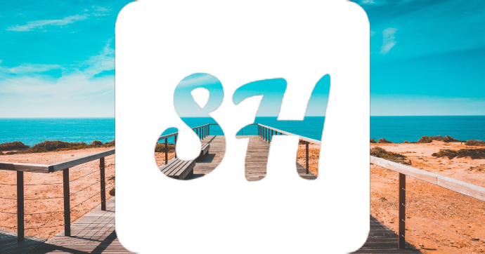

 

**Hi There!** 

This is me welcoming you to **Smart Hack**, a platform dedicated to sharing useful hacks that I’ve found incredibly helpful in my daily life. Whether it's an educational tool, a computer hack, or any other useful resource, you'll find it here! 

These tools have made a huge difference in my productivity. Whether you're working on creative projects, analysis, or need quick solutions, these tools will help you work smarter, not harder.

## Why These Tools?
If you are someone who works in academics, design, and content creation, you know how important it is to have the right tools at your disposal. These tools help save time, improve productivity, and deliver high-quality results. Whether you're a beginner or an experienced professional, these tools can enhance your productivity.

## Categories
Find tools in the following categories or use the keyword search:
- [PC](/tags/pc)
- [Smart Phone](/tags/smart-phone)
- [Picture](/tags/picture)
- [DIY](/tags/diy)
- All [categories...](/tags/)

## Featured Tools
- **[[Background Remover]]:** 
An AI-powered tool that instantly removes backgrounds from images with a single click. It's perfect for creating professional images, banners, or social media posts.  
- **[[Favicon Generator]]:**
A free online tool that creates high-quality favicons from text, images, or emojis, perfect for branding your website. 
- **[[Image Resizer]]:**
A simple online tool to resize, crop, and optimize your images effortlessly. Whether you need to resize images for social media, websites, or presentations, this tool has you covered. 
- [[hacks|See more...]]

## Get In Touch
If you have any questions or need help using these tools or you would like to add some of the tools you have found interesting and useful in your daily life, feel free to [[contact|reach out!]]

---

**Disclaimer:** 
These tools are third-party services that we personally recommend based on our own experience. We don’t own or operate them, but we think they’re great! Please review their terms and conditions. 

